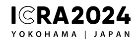

               

Clinical success of medical robotic platforms is the outcome of continuous efforts in translational research. This journey starts with an initial idea based on a clinical need and targets its long-term translation into a clinically-approved device. Milestones along this path predominantly aim at increased technical maturity of existing laboratory demonstrators or proofing feasibility in relevant preclinical/clinical environments involving end-users – essential steps for prospective clinical clearance and approval processes. Major challenges in translational research arise also from holistic consideration of complex and dynamic ethical and regulatory aspects. 
 
This workshop aims at engaging the clinical/robotics community presenting stories on translating medical robots into clinical use. The attendees will have the opportunity to hear journeys of those who have gone through the complex process of translating a medical robot from the lab bench to clinical use. Updates on ethical considerations or regulatory affairs supporting translational roadmaps will also be discussed. The goal is to define a roadmap for successful clinical translation, addressing clinical opportunities, technical requirements and regulatory challenges for translating robots to practical clinical use. The outcome will be a timely and up-to-date analysis of challenges that need to be resolved, and further consolidate the collaboration between clinical, engineering, and regulatory communities. 

## Date, Time, and Place
* Friday, May 17th 2024
* 8:45AM - 17:30PM
* Pacific Convention Plaza Yokohama(PACIFICO Yokohama) 1-1-1, Minato Mirai, Nishi-ku, Yokohama 220-0012, JAPAN

## List of speakers

* **Prof Pietro Valdastri** - University of Leeds, UK
* **Prof Kevin Cleary** – Children’s National, USA
* **Prof Sanja Dogramadzi** - The University of Sheffield, UK
* **Prof Kiyokazu Nakajima** - Osaka University, JP
* **Prof Philip Chiu** - The Chinese University of Hong Kong, HK
* **Prof Thiusius R. Savarimuthu** – SDU Robotics, DK
* **Prof Dong-Soo Kwon** - ROEN Surgical Inc., KR
* **Prof Michael Yip** - University of California San Diego, USA
* **Dr Claudio Pacchierotti** – CNRS, Inria, FR
* **Prof Alan Kuntz** – University of Utah, USA
* **Prof Silvana Perretta** - University of Strasbourg, IHU-Strasbourg

## Agenda (Times in UTC-3)
* 08:45 - 09:00 Welcome and introduction to the WS
  
### Session 1 – Translational Stories 1
* 09:00 - 09:30 **Prof Pietro Valdastri** - University of Leeds, UK, “Intelligent magnetic colonoscopy: from bench to bed trials"
* 09:30 - 10:00 **Prof Kevin Cleary / Prof Reza Monfaredi** – Children’s National, USA, “MR-Compatible Robotics” [in person + virtual contribution]
* 10:00 - 10:20 Coffee Break
* 10:20 - 10:50 **Prof Sanja Dogramadzi** - The University of Sheffield, UK, “Robot-Assisted Fracture Surgery”

### Session 2 – Commercialization
* 10:50 - 11:15 **Prof Thiusius R. Savarimuthu** – SDU Robotics, DK, “The ROPCA Journey"
* 11:15 - 11:40 **Dr Rainer Konietschke** – Medtronic GmbH, DE, "Medtronic presenting on HugoTM robotic assisted surgery system"
* 11:40 – 12:05 **Prof Dong-Soo Kwon** - ROEN Surgical Inc., KR, “Robotic Ureteroscopic System from Research to Commercialization”
* 12:05 – 12:30 **Dr Gernot Kronreif** – Austrian Center for Medical Innovation and Technology, AT “The path from concept to certified robot – challenges and lessons learned”

### Lunch Break
* 12:30 - 13:30 Lunch Break
### Young Researchers Session
* 13:30 - 13:50 Young Researchers Session
  
### Session 3 – Translational Stories 2
* 13:50 - 14:15 **Prof Michael Yip** - University of California San Diego, USA, "Achieving Contextual Understanding and Automation in Surgery with the daVinci Research Kit"
* 14:15 - 14:40 **Dr Claudio Pacchierotti** – CNRS, Inria, FR, "The potential of haptic feedback for medical robotics: from robot-assisted surgery to 
microrobotics"
* 14:40 - 15:05 **Prof Alan Kuntz** – University of Utah, USA, “Automation on the Virtuoso system”
 
### Session 4 –  Clinical Perspectives
* 15:00 - 15:30 **Prof Silvana Perretta** - University of Strasbourg, IHU-Strasbourg, FR [virtual]
* 15:30 - 16:00 Coffee Break
* 16:00 – 16:30 **Prof Kiyokazu Nakajima** - Osaka University, JP, “Limitation of using flexible robot inside the abdomen” 
* 16:30 - 17:00 **Prof Philip Chiu** - The Chinese University of Hong Kong, HK “Development of Endoluminal Robotics for Colorectal ESD - From bench to clinical translation” [virtual]

### Closing remaarks
*17:00 - 17:10 Closing Remarks

## Organizers
* Giulio Dagnino, Assistant Professor, RaM Lab, University of Twente, NL
* Dennis Kundrat,  Head of Department Individualized Therapy, Fraunhofer Research Institution for Individualized and Cell-Based Medical Engineering IMTE, Lübeck, Germany
* Momen Abayazid, Associate Professor, RaM Lab, University of Twente, NL 
* Luigi Manfredi, Senior Lecturer, University of Dundee, UK  
* Helge Wurdemann, Professor, University College London, UK  
* Pedro Moreira, Instructor, Brigham and Women's Hospital, Harvard Medical School, USA 

